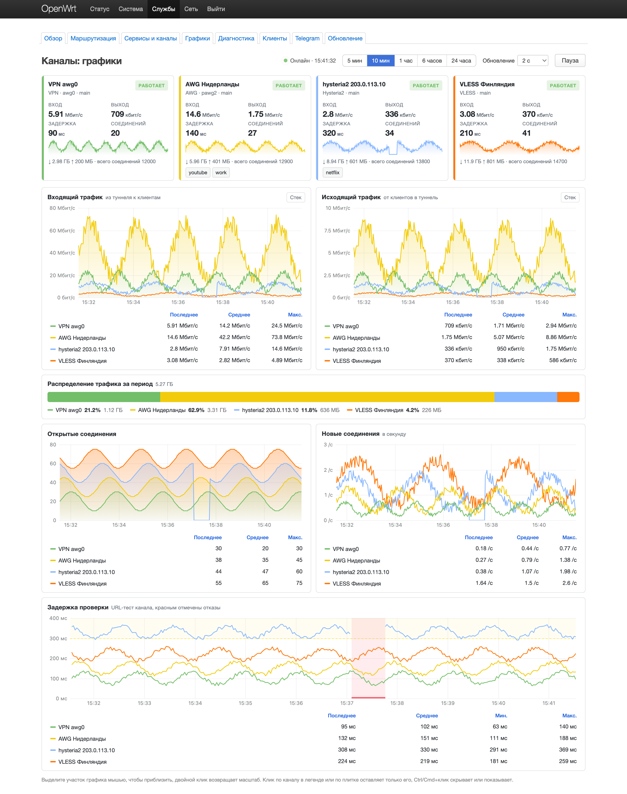

# Hybrid Failover

English | [Русский](README.md)

Routing for OpenWrt with automatic failover. The primary path runs through a VPN (AmneziaWG). When it goes down, traffic moves to backup proxies and comes back once the VPN recovers. Devices on the network need no configuration.

Everything runs inside one Go binary on the router. No external sing-box, jq or python is needed. You manage it from LuCI or from Telegram.


## Features

- Transparently intercepts LAN traffic with nft tproxy and routes it by rules. Rules are domains, subnets and community lists such as youtube, telegram or russia_inside.
- DNS answers with fakeip addresses from 198.18.0.0/15, so traffic to routed domains reaches the engine before any real lookup happens.
- Channels are checked by urltest. The live and fastest one is picked automatically, with `outage-only`, `prefer-primary` and `fastest` policies.
- Supports `vless://`, `ss://`, `trojan://`, `hysteria2://`, `socks5://` links and Amnezia `vpn://` exports, including AmneziaWG 3.1.
- Per-device rules by IP. A console can always go through the VPN while a TV bypasses it.
- Service lists can be spread over separate tunnels so YouTube does not share a channel with everything else. Each list gets a channel and a fallback for when that channel is down, with automatic spread and balancing. Your own lists of domains and subnets are bound the same way.
- Live per-tunnel charts in LuCI: traffic, connections, latency and traffic share, from 5 minutes up to a day.
- A Telegram bot shows status and channels, switches them, edits the config and sends failover alerts.



## Install

On a router running OpenWrt 24.x or 25.12:

```sh
wget -O /tmp/install.sh \
  https://raw.githubusercontent.com/timofey-maykov/openwrt-hybrid-failover/main/scripts/install-on-router.sh
ash /tmp/install.sh
```

The script detects the architecture, downloads the latest [release](https://github.com/timofey-maykov/openwrt-hybrid-failover/releases) and installs the packages with opkg or apk.

| `HF_MODE` | Installs |
|-----------|----------|
| `full` (default) | service, LuCI and the Telegram bot |
| `core` | service and LuCI, no bot |
| `bot` | the Telegram bot only |

Set the mode through the environment, for example `HF_MODE=core ash /tmp/install.sh`. The Telegram tab in LuCI shows up only when the bot is installed.

After installing, open Services, then Hybrid Failover in LuCI. Updates are available from LuCI or with `hybrid-failover update apply`.

AmneziaWG needs `kmod-amneziawg` and `amneziawg-tools` built for your OpenWrt version. They are not part of the release. See [docs/en/INSTALL.md](docs/en/INSTALL.md).

## Supported links

| Scheme | Notes |
|--------|-------|
| `vless://` | Reality, XTLS, transport from query parameters |
| `ss://` | Shadowsocks |
| `trojan://` | |
| `socks4://`, `socks4a://`, `socks5://` | UDP over TCP with `enable_udp_over_tcp` |
| `hysteria2://`, `hy2://` | TLS, obfs, bandwidth limits |
| `vpn://` | Amnezia export, converted to `vless://` or `awg2://` |
| `awg2://` | Internal core link for AmneziaWG, including 3.1 |

Links can be added from LuCI or from the Telegram bot. The core validates them on apply.

## Telegram bot

The bot runs on the router and controls it through the core. Get a token from [@BotFather](https://t.me/BotFather) and put it into `/etc/hybrid-failover-bot.json` together with `admin_ids`. Then enable the service:

```sh
uci set hybrid-failover-bot.main.enabled=1 && uci commit hybrid-failover-bot
/etc/init.d/hybrid-failover-bot restart
```

Open `/panel` in Telegram. With several routers, either give each router its own bot or connect them to one bot over SSH. Both setups are described in [bot/README.en.md](bot/README.en.md).

## Documentation

| File | Topic |
|------|-------|
| [docs/en/OVERVIEW.md](docs/en/OVERVIEW.md) | Architecture, routing modes, DNS, failover, per-device rules |
| [docs/en/INSTALL.md](docs/en/INSTALL.md) | Install, updates, AmneziaWG 3.1 |
| [docs/en/LUCI.md](docs/en/LUCI.md) | Web interface, tab by tab |
| [docs/en/UCI.md](docs/en/UCI.md) | Every option in `/etc/config/hybrid-failover` |
| [bot/README.en.md](bot/README.en.md) | Telegram bot, commands, multiple routers |
| [luci/README.en.md](luci/README.en.md) | LuCI and rpcd sources |
| [packages/README.en.md](packages/README.en.md) | Building `.ipk` and `.apk` packages |

The LuCI interface is in Russian with an English translation.

## Repository layout

| Path | Contents |
|------|----------|
| `core/`, `internal/` | Go core and engine |
| `bot/` | Telegram bot |
| `luci/` | luci-app-hybrid-failover |
| `openwrt/` | init.d script and UCI template |
| `packages/` | Package build |
| `scripts/` | Install, build, QEMU test labs |
| `docs/` | Russian docs, English ones in `docs/en/` |
| `legacy/` | Old scripts, not shipped |

Build packages locally with `./scripts/build-packages.sh`. GitHub Actions builds the release when a `v*` tag is pushed.
