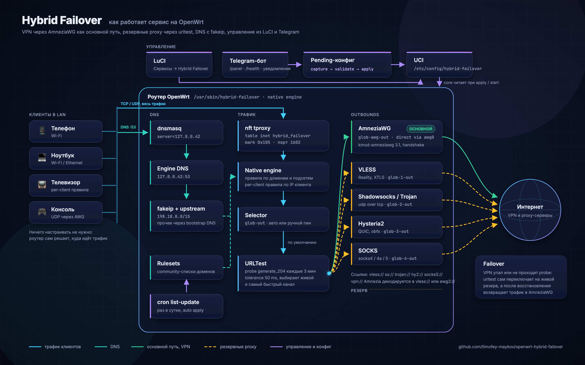
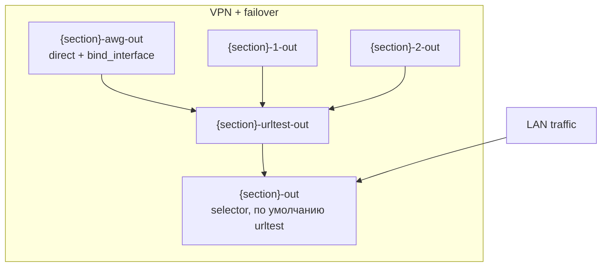
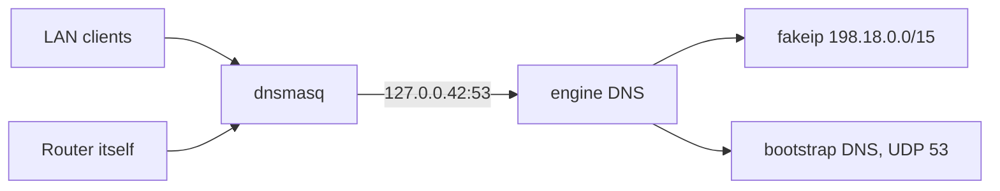

[English](en/OVERVIEW.md)

# Hybrid Failover: полное описание

Автономный стек маршрутизации для OpenWrt. В бинарник `hybrid-failover` встроен собственный **proxy engine** (tproxy, DNS с fakeip, outbounds, urltest). Есть поддержка Amnezia `vpn://`, расширенный URLTest, Telegram-бот и LuCI на русском.

**Core:** `/usr/sbin/hybrid-failover` · **UCI:** `/etc/config/hybrid-failover` · **nft:** `inet hybrid_failover`

---

## Содержание

1. [Архитектура](#архитектура)
2. [Режимы маршрутизации](#режимы-маршрутизации)
3. [Поддерживаемые форматы ссылок (URI)](#поддерживаемые-форматы-ссылок-uri)
4. [Опции UCI](#опции-uci)
5. [Пакеты OpenWrt](#пакеты-openwrt)
6. [Установка](#установка)
7. [LuCI](#luci)
8. [Per-client правила](#per-client-правила)
9. [Telegram-бот](#telegram-бот)
10. [Диагностика](#диагностика)
11. [Типичные проблемы](#типичные-проблемы)
12. [Содержимое репозитория](#содержимое-репозитория)

---

## Архитектура



Go core `hybrid-failover` читает UCI и компилирует из него план для встроенного engine. Затем он настраивает nft tproxy (таблица `inet hybrid_failover`, mark `0x105`, порт 1602) и запускает engine внутри своего процесса. Под procd работает `hybrid-failover monitor`. В этом процессе живут engine, контроллер политики failover и watchdog.

Внешнего sing-box больше нет. Единственный режим `settings.engine_mode=native`. Старый `engine_mode=singbox` удалён, и `hybrid-failover migrate` переводит такие конфиги на native. Пакет `internal/singbox` остался в коде ради имён тегов и миграции, трафик через него не идёт.

LuCI и бот общаются с core через `hybrid-failover rpc <Method>`. Для LuCI вызов идёт через rpcd (ucode-скрипт `/usr/share/rpcd/ucode/hybrid-failover`). Ручное переключение канала передаётся работающему engine через IPC-файлы в `/var/run/hybrid-failover`. HTTP-сервера Clash API у native engine нет, порт 9090 не открывается.



Для секции `glob` (имя произвольное, теги получают этот префикс) создаются такие outbounds.

| Outbound | Назначение |
|----------|------------|
| `{section}-awg-out` | Основной путь, **direct** через VPN-интерфейс (`option interface`, напр. `awg0`) |
| `{section}-1-out`, `{section}-2-out`, ... | Резервы из `failover_proxy_links`, по одному на URI |
| `{section}-urltest-out` | **urltest** по AWG и всем резервам |
| `{section}-out` | **selector**, по умолчанию указывает на urltest |

Порядок URI в списке задаёт приоритет кандидатов после основного VPN. Внутри urltest выбирается живой и быстрый.

```text
hybrid-failover migrate [--dry-run]
hybrid-failover validate [--dry-run]
hybrid-failover apply [--dry-run]
hybrid-failover start|stop|reload|restart|status|health|monitor
hybrid-failover rpc <method> [json args]
hybrid-failover pending capture|validate|apply|rollback
hybrid-failover check-nft|check-proxy|check-fakeip|global-check
hybrid-failover list-update|subscription-refresh
hybrid-failover update check|apply|status [--tag vX.Y.Z] [--force]
```

### DNS через 127.0.0.42

При `start` core переключает dnsmasq на DNS engine, если не задан `settings.dont_touch_dhcp=1`.

1. **dnsmasq.** Текущие настройки сохраняются в `/etc/hybrid-failover/dnsmasq-dhcp.bak`, затем ставятся `noresolv=1` и `server=127.0.0.42`.
2. **DNS engine.** Слушает `127.0.0.42:53`, раздаёт fakeip из `198.18.0.0/15` и учитывает community-списки. Остальные имена он резолвит обычным UDP-запросом к `settings.bootstrap_dns_server` (по умолчанию 77.88.8.8). Опции `dns_type` и `dns_server` native engine сейчас не использует.
3. **Проверка.** `hybrid-failover check-fakeip` спрашивает у `127.0.0.42` имя `fakeip.hybrid-failover` и ждёт адрес `198.18.x.x`.

При `stop` dnsmasq восстанавливается из backup. При загрузке init-скрипт сначала возвращает dnsmasq к обычным upstream, если там остался `127.0.0.42`, чтобы LAN не сидел без DNS, пока engine не поднялся.



### Pending-конфиг (LuCI и бот)

LuCI и бот не коммитят UCI сразу. Они ставят изменения в staging (`uci set` без `commit`), а core ведёт снимок этих изменений в `/etc/hybrid-failover/pending`.

| Шаг | CLI | Что делает |
|-----|-----|------------|
| Capture | `pending capture` | Читает `uci changes hybrid-failover` и дописывает их в снимок |
| Validate | `pending validate` | Проверяет ключи и значения из снимка |
| Apply | `pending apply` | Коммитит staged-изменения, пересобирает план и перезагружает engine |
| Rollback | `pending rollback` | Удаляет снимок |

Снимок нужен на случай, если staging пропал, например после перезагрузки очистился `/tmp/.uci`. Тогда `pending apply` проигрывает изменения из снимка. Если staged-изменения на месте, применяются именно они, а снимок повторно не накладывается.

Те же шаги доступны как RPC-методы `CapturePending`, `PendingValidate`, `PendingApply` и `PendingRollback`. В LuCI кнопка "Сохранить" на странице маршрутизации делает capture, "Применить" вызывает `pending_apply`.

### Списки и cron

- `list-update` скачивает community-списки в `/etc/hybrid-failover/rulesets/`. Если списки изменились, core пересобирает план и обновляет engine без полного рестарта.
- При `start` core тоже запускает обновление списков.
- `update_interval` в секции `settings` (по умолчанию `1d`) задаёт cron-задачу `hybrid-failover list-update`. Задача ставится при `start`, если в конфиге есть списки, и снимается при `stop`.

---

## Режимы маршрутизации

### 1. VPN + failover

| UCI | Значение |
|-----|----------|
| `connection_type` | `vpn` |
| `failover_vpn_enabled` | `1` |
| `failover_proxy_links` | список URI (см. таблицу ниже) |
| `interface` | VPN-интерфейс, напр. `awg0` |

Трафик секции сначала идёт через VPN-интерфейс. Если он недоступен, urltest переключается на резервные proxy из списка.

### 2. Proxy и URLTest

| UCI | Значение |
|-----|----------|
| `connection_type` | `proxy` |
| `proxy_config_type` | `urltest` |
| `urltest_proxy_links` | список URI |

Здесь только proxy, без `bind_interface`. Форматы URI и опции urltest те же.

### Общие параметры URLTest

| Опция UCI | По умолчанию | Описание |
|-----------|--------------|----------|
| `urltest_check_interval` | `3m` | Интервал проверки |
| `urltest_tolerance` | `50` | Допуск по задержке (ms) |
| `urltest_testing_url` | `https://www.gstatic.com/generate_204` | URL для probe |
| `urltest_idle_timeout` | пусто | Таймаут простоя urltest (напр. `5m`) |
| `urltest_interrupt_exist_connections` | `0` | `1` рвёт существующие сессии при смене узла |
| `enable_udp_over_tcp` | `0` | Для SS и SOCKS в списках ссылок |

---

## Поддерживаемые форматы ссылок (URI)

Ссылки разбираются в Go (`internal/uri`). Amnezia `vpn://` декодирует `internal/amnezia`, Python не нужен.

### В `failover_proxy_links` и `urltest_proxy_links`

| Схема | Поддержка | Примечание |
|-------|-----------|------------|
| `vless://` | да | Reality, XTLS, transport из query |
| `ss://` | да | Shadowsocks |
| `trojan://` | да | |
| `socks4://`, `socks4a://`, `socks5://` | да | `enable_udp_over_tcp` при необходимости |
| `hysteria2://`, `hy2://` | да | TLS (`sni`, `insecure`), obfs, `up`/`down` в mbps |
| `vpn://` | да | Экспорт **Amnezia**, превращается в `vless://` (xray) или `awg2://` (awg, awg2) |
| `awg2://` | да (служебный URI) | Не протокол, см. [ниже](#amnezia-awg2-awg2) |
| `http://`, `https://` | нет | Ошибка `unsupported scheme` |

### Amnezia `vpn://`

Декодер встроен в core (`internal/amnezia`). Поддерживается типичный экспорт **amnezia-xray** с VLESS в `last_config`. В LuCI строку `vpn://...` можно вставлять как есть.

### Amnezia AWG2 (`awg2://`) {#amnezia-awg2-awg2}

`awg2://` не отдельный сетевой протокол. Это служебный формат core для настройки **AmneziaWG**, включая 3.1. Core делает три вещи.

1. Создаёт интерфейс типа `amneziawg`.
2. Применяет к нему конфиг через `awg setconf`.
3. Добавляет в план engine direct outbound, привязанный к этому интерфейсу.

Строка `awg2://...` появляется при конвертации `vpn://`, если в контейнере Amnezia указан `amnezia-awg2` или `amnezia-awg`. В LuCI можно сразу вставлять `vpn://`.

Декодер переносит в query `awg2://` поля версии 3.1. Это `header_protection_key`, `content_padding_addition`, `random_trailers`, `disable_cookies`, таймеры (`rekey_after_time`, `rekey_timeout`, `reject_after_time`, `keepalive_timeout`, `max_handshake_attempts`) и `persistent_keepalive` в виде диапазона (`25-35`).

#### Пакеты на роутере

Core только пишет конфиг. Туннель поднимают `kmod-amneziawg` и `amneziawg-tools`. Для экспорта Amnezia 3.1 (`protocol_version: 3.1`, `RandomTrailers`) нужны пакеты 3.1 или новее. Они должны быть собраны под тот же OpenWrt и vermagic ядра, что стоит на роутере (`opkg info kernel`). Готовые `.ipk` часто лежат в релизах [2Grey/awg-openwrt](https://github.com/2Grey/awg-openwrt) с тегом версии OpenWrt (например `v24.10.6`).

```sh
awg --version          # должно быть 3.1.x, не 1.0.20260618
awg set --help | grep random-trailers
```

Инструменты 3.0 отклонят конфиг с ошибкой `Line unrecognized: RandomTrailers=on`, и интерфейс не поднимется.

#### Handshake и несовпадение параметров

С сервером должны совпасть `S1-S4`, `H1-H4`, `HeaderProtectionKey` и `RandomTrailers`. Опция `RandomTrailers=on` работает в обе стороны. Сервер 3.1 удлиняет пакеты handshake, клиент 3.0 их не узнаёт и молча отбрасывает. Снаружи это выглядит странно. В conntrack UDP-сессия в состоянии `ASSURED`, ответы приходят, а `awg show` показывает `0 B received` и ни одного handshake.

`DisableCookies`, `Jc`, `Jmin`, `Jmax` и `ContentPaddingAddition` совпадать не обязаны.

Старый профиль AWG 2.0 (диапазоны `H1-H4`, `I1`, без `HeaderProtectionKey`) на порту сервера 3.1 handshake не получит. Не держите такие URI в `urltest_proxy_links` рядом с 3.1, иначе watchdog будет перебирать endpoint мёртвого пира.

Один `vpn://` нельзя одновременно использовать на роутере и в приложении Amnezia на устройстве в LAN. У AWG один ключ даёт одну сессию. Телефон заберёт endpoint, и роутер останется без handshake.

```sh
awg show               # latest handshake, transfer
```

В режиме urltest карточка канала в LuCI сначала смотрит на HTTP-проверку (`urltest_testing_url`). Для AWG поверх неё учитывается handshake. Если handshake свежий, а HTTP не проходит, карточка пишет "handshake есть, HTTP urltest не проходит". Если handshake нет или он старше трёх минут, канал показан как DOWN с причиной.

Трафик идёт через selector. Пока в нём выбран urltest, живым каналом считается победитель HTTP-проверки, часто это Hysteria. Сам по себе handshake AWG urltest не переключает. Ручное "Переключить" закрепляет selector на конкретном outbound. Команда `SwitchProxy` уходит в процесс monitor через IPC и не ждёт следующего цикла опроса контроллера.

### Ссылки через Telegram-бота

Бот проверяет ссылки той же функцией, что и core (`internal/validation`). Принимаются `vless`, `trojan`, `ss`, `vpn`, `socks4`, `socks4a`, `socks5`, `hysteria2`, `hy2` и `awg2`.

---

## Опции UCI

Подробная таблица лежит в [`docs/UCI.md`](UCI.md), пример команд в [`examples/glob-uci-commands.txt`](../examples/glob-uci-commands.txt).

Конфиг хранится в `/etc/config/hybrid-failover`. После установки или обновления запустите `hybrid-failover migrate`.

### Миграция схемы

`migrate` при первом запуске импортирует прежний UCI, если нового конфига ещё нет. Потом он доводит `settings.config_schema_version` до 5.

| Схема | Что меняется |
|-------|--------------|
| v1 | `failover_vpn_enabled=0`, если опции не было. `failover_vpn_enabled=1` для VPN-секции, где уже есть `failover_proxy_links`. `urltest_interrupt_exist_connections=0`, если не задано |
| v2 | Legacy-списки клиентов переносятся в секции `client_rule` |
| v3, v4 | `settings.engine_mode=native`, в том числе вместо `singbox` |
| v5 | `settings.disable_lan_ipv6=1`, если опция не задана |

Миграция v1 также прописывает `settings.cache_path`. Эта опция осталась от sing-box, native engine её не читает.

---

## Пакеты OpenWrt

Пакеты собирает `./scripts/build-packages.sh`, готовые лежат в [Releases](https://github.com/timofey-maykov/openwrt-hybrid-failover/releases).

Бинарники сжимаются **UPX**, если `upx` есть на машине сборки. На `aarch64` это примерно 6 МБ до сжатия и 1,8 МБ после. Отключить можно через `HF_UPX=0 ./scripts/build-packages.sh`. Сам upx ставится через `brew install upx` или `apt install upx-ucl`.

| Пакет | Architecture | Содержимое |
|-------|----------------|------------|
| `hybrid-failover-core` | per-target | `/usr/sbin/hybrid-failover`, init.d, шаблон UCI |
| `hybrid-failover-bot` | per-target | Go-бинарник бота, init.d, JSON и UCI-шаблон |
| `luci-app-hybrid-failover` | all | Маршрутизация, дашборд, клиенты, бот, обновление |
| `luci-i18n-hybrid-failover` | all | Переводы LuCI |

Пакет core зависит от `ca-bundle`, `uci` и `procd`. Установщик дополнительно ставит `curl` и `wget`. Для `check-fakeip` не нужен `bind-dig`. Не нужны `jq`, `python3-light` и внешний sing-box. Пакеты `kmod-amneziawg` и `amneziawg-tools` в релиз HF не входят. Для `vpn://` с AWG 3.1 их ставит пользователь, см. [INSTALL.md](INSTALL.md#amneziawg-31).

---

## Установка

Полная инструкция в [`docs/INSTALL.md`](INSTALL.md).

```sh
wget -O /tmp/install.sh \
  https://raw.githubusercontent.com/timofey-maykov/openwrt-hybrid-failover/main/scripts/install-on-router.sh
ash /tmp/install.sh
hybrid-failover migrate
/etc/init.d/hybrid-failover enable && /etc/init.d/hybrid-failover start
```

| Режим (`HF_MODE`) | Устанавливает |
|-------|----------------|
| `full` (по умолчанию) | core, бот, luci-app-hybrid-failover |
| `core` | core и LuCI, без бота |
| `bot` | только бот |

### После установки бота

1. Получите токен у [@BotFather](https://t.me/BotFather) и впишите его в `/etc/hybrid-failover-bot.json`.
2. `uci set hybrid-failover-bot.main.enabled=1 && uci commit hybrid-failover-bot`
3. `/etc/init.d/hybrid-failover-bot restart`
4. В Telegram отправьте `/panel`.

---

## LuCI

Раздел **Сервисы -> Hybrid Failover**, адрес `/cgi-bin/luci/admin/services/hybrid-failover`.

Подробное руководство по вкладкам, клиентам, выбору из DHCP и pending лежит в [docs/LUCI.md](LUCI.md).

| Подраздел | Назначение |
|-----------|------------|
| Обзор | Дашборд: engine, nft, каналы и задержки, контроллер политики, журнал переключений, ручное переключение |
| Маршрутизация | VPN + failover, URLTest, подписки, community-списки (через pending) |
| Диагностика | validate, global-check, backup UCI |
| Клиенты | `client_rule` по IP, effective rules, выбор IP из DHCP |
| Telegram | JSON бота, pending validate, apply и rollback |
| Обновление | Проверка и установка новых релизов (`hybrid-failover update`) |

Все действия идут через rpcd в `hybrid-failover rpc`.

---

## Per-client правила

Глобальная маршрутизация (секции, списки доменов) определяет, какой трафик попадает в engine. Правила клиентов определяют, какие устройства LAN в этом участвуют и в каком режиме.

В UCI это секции `config client_rule`, в LuCI вкладка **Клиенты -> Правила клиентов**.

| `mode` | Поведение |
|--------|-----------|
| `include` | Клиент получает nft mark и идёт через tproxy в engine |
| `exclude` | Клиент идёт мимо Hybrid Failover (direct) |
| `full_route` | Весь трафик клиента через указанную секцию (`option section`) |
| `global_exclude` | Клиент исключён из tproxy глобально |

Итоговые правила на странице **Клиенты** берутся из `hybrid-failover rpc ListClients` (только чтение). Пустой список при работающем core значит, что правил нет. Это не ошибка.

Legacy-списки (`settings.include_source_ips`, `exclude_source_ips`, `fully_routed_ips` в секциях) `migrate` переносит в `client_rule`. Пока есть хотя бы один `client_rule`, legacy-списки не используются.

```sh
# Пример: консоль 192.168.1.50 через HF
uci set hybrid-failover.console=client_rule
uci set hybrid-failover.console.ip='192.168.1.50'
uci set hybrid-failover.console.mode='include'
uci commit hybrid-failover
hybrid-failover reload
```

Подробнее в [UCI.md](UCI.md#config-client_rule-name) и [LUCI.md](LUCI.md#клиенты).

---

## Telegram-бот

Полный список команд и настроек в [`bot/README.md`](../bot/README.md).

- Бот редактирует UCI `hybrid-failover` через pending-конфиг (validate, apply, rollback).
- Статус, проверка каналов (`/health`, `/channels`) и история (`/history`) берутся из core RPC (`Status`, `Health`, `History`). Clash API для этого не нужен.
- `admin_ids` дают полный доступ. `viewer_ids` дают только чтение (`/status`, `/health`, `/channels`, `/history` и навигация по панели).
- Ссылки для failover принимаются тех же схем, что и в core.

Конфиг `/etc/hybrid-failover-bot.json`.

| Ключ | Назначение |
|------|------------|
| `token` | Токен бота от @BotFather |
| `router_name` | Имя роутера в панели, статусе и уведомлениях (по умолчанию hostname) |
| `admin_ids`, `viewer_ids` | Telegram ID администраторов и наблюдателей |
| `log_path`, `audit_path` | Лог бота и журнал действий |
| `routing_init_script` | По умолчанию `/etc/init.d/hybrid-failover` |
| `uci_package`, `main_section` | Пакет UCI и основная секция (обычно `glob`) |
| `policy`, `probe_timeout_seconds` | Политика и таймаут проверок |
| `notify_failover_enabled`, `notify_failover_interval_seconds` | Уведомления о переключениях и интервал опроса |
| `routers` | Управление несколькими роутерами по SSH |
| `clash_api` | Нужен только старым установкам на sing-box |

### Несколько роутеров

Telegram отдаёт обновления одного токена только одному получателю. Поэтому на каждом роутере лучше держать своего бота со своим токеном и задать ему `router_name`. Второй вариант подходит, если нужен один чат на все роутеры. Тогда один бот управляет остальными по SSH через список `routers`, а на остальных роутерах бот выключен. Детали и пример конфига в [`bot/README.md`](../bot/README.md#несколько-роутеров).

### Алерты при failover

**Через бота.** Включите `notify_failover_enabled: true` в `hybrid-failover-bot.json`. Бот читает `/var/log/hybrid-failover/history.jsonl` с интервалом `notify_failover_interval_seconds` (по умолчанию 30 с) и шлёт новые события всем `admin_ids`. Время последнего доставленного события бот запоминает в `/var/run/hybrid-failover-bot/history.state`, поэтому ротация журнала не вызывает повторов. В схеме с SSH уведомления приходят только с роутера, где запущен бот.

**Через webhook core.** Укажите HTTP endpoint в `hybrid-failover.settings.webhook_url`. При каждом автоматическом переключении core шлёт на него `POST` с JSON-телом события.

```json
{"time":"2026-09-29T10:15:00Z","section":"glob","from":"glob-awg-out","to":"glob-1-out","reason":"primary outage","policy":"outage-only"}
```

Принять такой запрос можно своим relay, который, например, перешлёт текст в Telegram через `sendMessage`. Core только делает `POST`, ответ должен быть 2xx.

---

## Диагностика

Отдельного HTTP API у engine нет. Состояние смотрят через CLI, RPC и системный лог.

```sh
hybrid-failover status          # JSON: engine, nft, fakeip, активный outbound, контроллер
hybrid-failover health          # то же плюс живая проверка каналов
hybrid-failover global-check    # то же, что status
hybrid-failover check-fakeip    # DNS-запрос к 127.0.0.42, без dig
hybrid-failover check-nft       # таблица inet hybrid_failover на месте
hybrid-failover rpc Health      # то, что видят LuCI и бот
logread -e hybrid-failover
```

Поле `clash_ok` в отчёте осталось для совместимости. В native оно просто повторяет `engine_running`. Опция `settings.clash_api_listen` на native engine не влияет.

В боте то же самое показывают `/status`, `/health` и `/channels`.

---

## Типичные проблемы

### Нет effective rules, пустая таблица на вкладке Клиенты

Core при этом может работать нормально (`engine_running: true` в статусе). Сообщение значит, что секций `client_rule` нет. Добавьте правило на вкладке **Клиенты** или через UCI, см. [LUCI.md](LUCI.md#клиенты).

### Нет leases, пустой выбор из DHCP

Список берётся из lease-файла dnsmasq (`/tmp/dhcp.leases`).

```sh
cat /tmp/dhcp.leases
/etc/init.d/dnsmasq status
```

`ubus call dhcp ipv4leases` в OpenWrt отдаёт данные, только если основной DHCPv4 это odhcpd. Leases от dnsmasq там не появятся.

### check-fakeip не проходит или у LAN нет DNS

Проверьте, что engine запущен и dnsmasq смотрит на него.

```sh
hybrid-failover status
uci -q get dhcp.@dnsmasq[0].server   # должен быть 127.0.0.42
hybrid-failover check-fakeip
logread -e hybrid-failover | tail -50
```

Если `127.0.0.42:53` занят старым экземпляром dnsmasq, помогает `/etc/init.d/hybrid-failover restart`. Core при старте сам проверяет этот случай.

### Двойной failover

Удалите сторонние скрипты автоматического failover и отключите конфликтующие init.d-сервисы маршрутизации, если переходите на Hybrid Failover. `hybrid-failover migrate` предупреждает о найденных конфликтах.

---

## Содержимое репозитория

| Путь | Назначение |
|------|------------|
| `core/`, `internal/` | Go core и встроенный engine |
| `packages/`, `packaging/` | Сборка `.ipk` и `.apk`, релизный workflow |
| `luci/` | luci-app-hybrid-failover |
| `bot/` | Telegram-бот |
| `openwrt/` | init.d, UCI-шаблон |
| `curfew/`, `luci-curfew/` | Отдельный пакет curfew (ограничение скорости устройств LAN) и его LuCI |
| `examples/` | Примеры UCI-команд и конфига бота для нескольких роутеров |
| `scripts/` | install-on-router.sh, build-packages.sh, QEMU lab |
| `docs/` | Документация |
| `legacy/` | Архивные заметки по миграции |

Общий README проекта лежит в [README.md](../README.md). Размер пакетов и место на overlay разобраны в [SING-BOX-SIZE.md](SING-BOX-SIZE.md).
