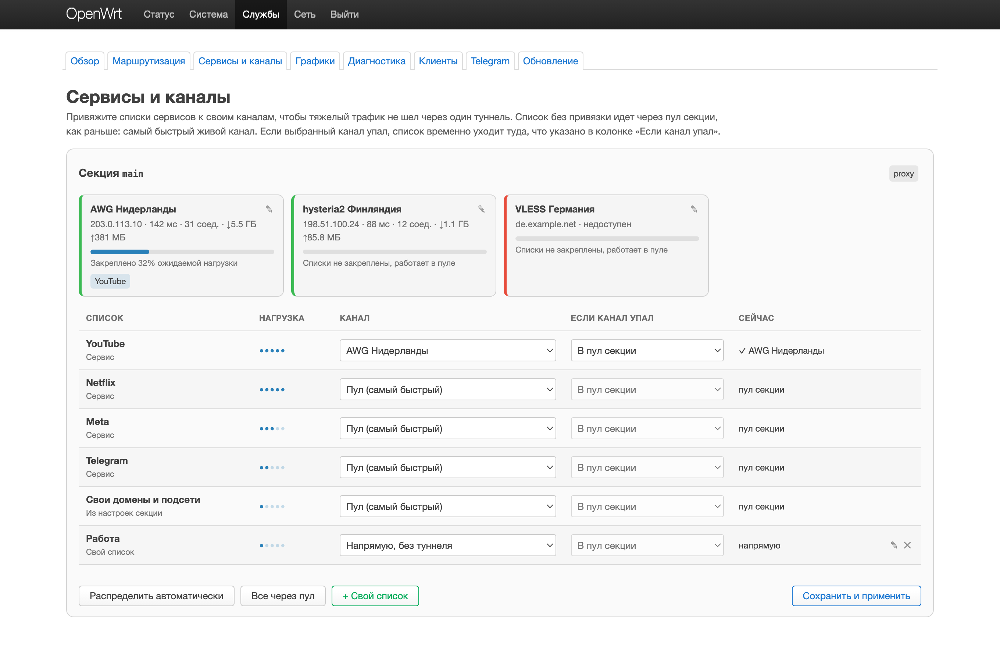
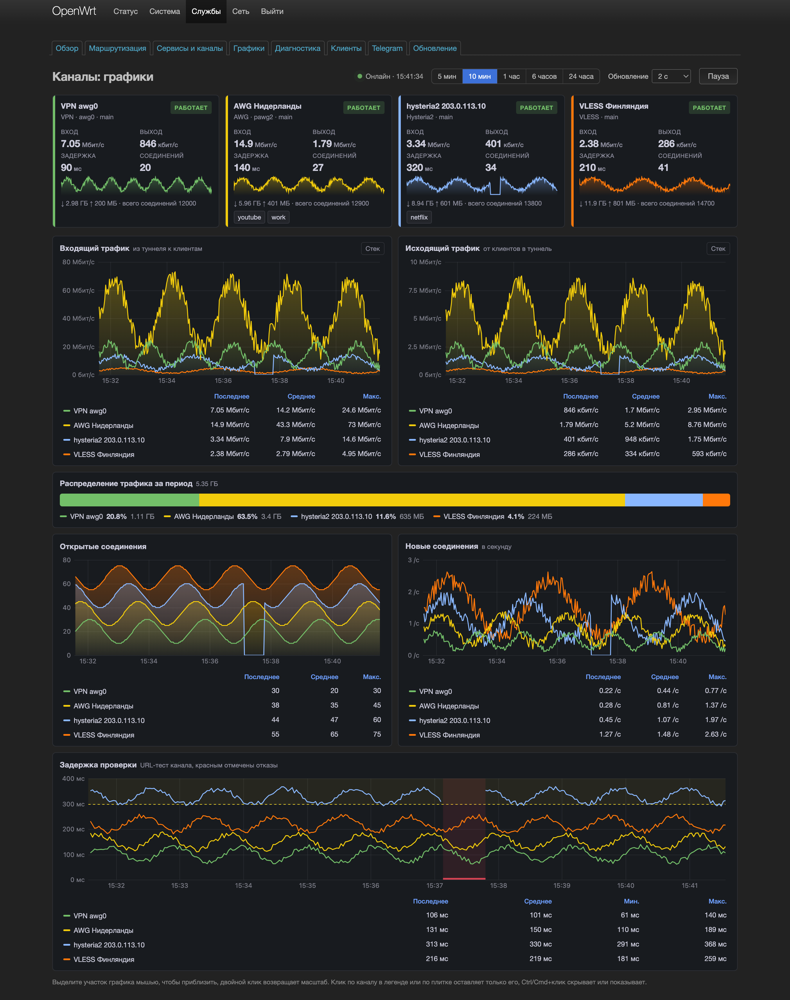

[Русский](../LUCI.md)

# LuCI user guide

The **`luci-app-hybrid-failover`** web interface configures Hybrid Failover on the router without editing UCI by hand.

**Menu:** Сервисы → Hybrid Failover (Services → Hybrid Failover)  
**URL:** `http://ROUTER/cgi-bin/luci/admin/services/hybrid-failover`

It needs **`hybrid-failover-core`** installed (binary `/usr/sbin/hybrid-failover`). LuCI talks to it through rpcd. Every button calls a `hybrid-failover.*` ubus method, and rpcd runs `hybrid-failover rpc <Method>` and returns the JSON.

The UI is written in Russian. This guide quotes the Russian labels as they appear on screen, with an English translation in parentheses the first time. An English translation catalog exists (`luci/po/en`), so with LuCI set to English many labels do show in English, but the catalog is incomplete and newer labels stay Russian. See [luci/README.en.md](../../luci/README.en.md) for details.

---

## Getting started

1. Install the packages as described in [INSTALL.md](INSTALL.md). The `full` mode installs the core, LuCI and the bot. The install script runs `hybrid-failover migrate` itself and enables and starts the service.
2. Open **Сервисы → Hybrid Failover**. It lands on the **Обзор** (Overview) tab. The status next to the title should read "В норме" (Healthy), and the Engine, nft / tproxy and Control cards should show "работает" (running) and OK.
3. Configure **Маршрутизация** (Routing): VPN or proxy, domain lists.
4. If needed, add rules on the **Клиенты** (Clients) tab for a console, a TV or a phone that needs a different mode.

---

## Tabs

| Tab | What it is for |
|-----|----------------|
| **Обзор** (Overview) | Live status: engine, nft, fakeip DNS, policy, active outbound, failover channels with latency, controller, switch log, manual switch |
| **Маршрутизация** (Routing) | Global settings and routing sections: VPN with backups, URLTest, subscriptions, community lists, your own domains and subnets |
| **Сервисы и каналы** (Services and channels) | Section channels with latency and load, a "list → channel → if the channel is down → now" table, your own lists, automatic spread |
| **Графики** (Charts) | Live per-channel charts, refreshed every 2 seconds |
| **Диагностика** (Diagnostics) | Validate, check-nft, check-fakeip, global-check, UCI backup and restore |
| **Клиенты** (Clients) | Per-client rules by IP (`client_rule`): Include, Exclude, Full route, Global exclude |
| **Telegram** | The bot service and its JSON config through pending: validate, apply, roll back, restart |
| **Обновление** (Update) | Checks GitHub for a new version and installs the release from LuCI |

---

## Overview

This page only shows state. Nothing is edited here. Data refreshes every 5 seconds, and next to the **Обновить** (Refresh) button you see the time of the last refresh and a countdown to the next one. The **Секция** (Section) picker in the header selects which routing section the controller and channels are shown for.

Next to the title is the overall status. It is one of "В норме" (Healthy), "Деградация" (Degraded), "Недоступно" (Unavailable) or "Неизвестно" (Unknown). Unavailable means the engine, nft or the control plane is not working. Degraded shows up when the primary VPN is down and traffic runs over a backup, when the fakeip check failed, or when the core reported errors. The core version and engine mode (`native`) are shown there too.

Below the title is a large status block with the active channel and links to Routing, Diagnostics and Clients. Under it are four inner tabs.

**Обзор** (Overview). Cards for Engine, nft / tproxy, Control, fakeip DNS, Политика (Policy), Активный outbound (Active outbound) and Резервы (Backups, how many backup channels are alive, for example `2/3 живы`). Then the failover channel cards and the Маршрут (Route), Контроллер (Controller) and URLTest panels. They show the selector, mode, primary probe, primary latency, time of the last probe and last switch, fail and recover counters, and urltest parameters. On the right is the **Ручное переключение** (Manual switch) block.

**Каналы** (Channels). A channel table with status, channel, type, latency, trend and role. The trend line is drawn from the latency history the core writes to `/var/run/hybrid-failover/delay-history.json` (RPC `DelayHistory`). Its buffer size is set by "Точек delay-history на канал" (delay-history points per channel) on the Routing tab. When there is no server history, the chart uses the last 40 samples the browser stored locally.

**Журнал** (Log). Switch history from `/var/log/hybrid-failover/history.jsonl` with time, section, transition, reason, policy and probe. It shows the last 15 or 50 events.

**Инструменты** (Tools). Buttons **Live probe**, **global-check**, **check-fakeip**, **Экспорт журнала** (Export log, downloads `failover-history.json`) and **Сбросить графики** (Reset charts). Reset charts clears only the latency history kept in the browser. The server file stays. The manual switch block is repeated here.

**Live probe** runs only when you press it. It re-checks every channel, which is a noticeable load on small routers, so the auto refresh does not do it.

### AWG channels

For a primary channel on WireGuard or AmneziaWG (`{section}-awg-out`) the handshake is the main signal and the HTTP check is secondary. With a fresh handshake and a failed HTTP urltest the channel counts as UP with the note `wireguard handshake OK`. With no handshake, or one older than 3 minutes, it is DOWN with the reason `no wireguard handshake` or `wireguard handshake stale (...)`. These reasons come from the core in English.

### Manual switch

Pick a section and an outbound and press **Переключить** (Switch). After you confirm, the section's selector is pinned to that channel. With the `fastest` policy manual switching is disabled because urltest picks the channel.

In urltest mode the HTTP check picks the group member by itself. The AWG card can show UP from the handshake while traffic still goes through a backup, as long as the selector points at URLTest. On old versions the error "switch request timed out" is fixed by updating the core to 1.7.35 or later.

If the page shows an error or "Нет данных" (No data), check `/etc/init.d/hybrid-failover status` and run global-check on the **Диагностика** tab.

---

## Routing

This is where you set where traffic goes once it matches Hybrid Failover rules: community lists, your own domains and subnets, and the section's default route.

### Global settings

"Глобальные настройки" (Global settings) has fields for enabling Hybrid Failover, the DNS type and server, Bootstrap DNS, turning off QUIC and LAN IPv6, the main section, the list update interval, downloading community lists through a proxy, the Webhook URL, "Исключить IP из маршрутизации" (Exclude IPs from routing), the controller probe interval, the failover log size, the delay-history buffer size and Subscription URLs.

The form still has "Путь cache sing-box" (sing-box cache path), "Clash API listen", "Включить Yacd (Clash UI)" (Enable Yacd) and the fields tied to them. They belong to the old sing-box engine. The native engine does not read them.

### Routing section (`config section`)

The section name is free-form (`main`, `glob` and so on). Outbound tags are derived from it: `{section}-out`, `{section}-urltest-out`, `{section}-awg-out`.

| "Тип подключения" (Connection type, `connection_type`) | Meaning |
|-------------------|--------|
| `vpn` | Main path over a VPN interface (`interface`, e.g. `awgch`). With "VPN + резервные proxy" (VPN + backup proxies) on you can add backups in `failover_proxy_links` |
| `proxy` | Proxy only: a single link (`proxy_string`), Outbound JSON, or a URLTest group (`urltest_proxy_links`) |
| `block` | Reject for this section's domains and subnets |

**VPN with backups.** When the VPN goes down, traffic moves to the backup URIs in "Резервные URI" (Backup URIs). List order is priority, and the **Вверх** (Up) and **Вниз** (Down) buttons reorder it. The policy is set in "Политика failover" (Failover policy): `outage-only`, `prefer-primary` or `fastest`. The **Проверить URI** (Check URI) button shows how the core parsed a link.

**Lists.** Community lists, your own domains (`user_domains`, `user_domains_text`) and subnets (`user_subnets`, `user_subnets_text`) decide which traffic lands in the section.

### How changes are saved

At the bottom of the page is the **Применение конфигурации** (Apply configuration) block.

- **2. Проверить** (2. Validate) saves the form and calls `hybrid-failover rpc Validate`. The result appears in the box under the buttons.
- **3. Применить** (3. Apply) is enabled only after a successful validation. It runs `hybrid-failover apply`, which rebuilds the config and restarts routing if anything changed.
- **Сохранить и применить** (Save and apply) in this block saves the form, validates it and applies right away if validation passes.
- **Откатить pending** (Roll back pending) deletes the snapshot `/etc/hybrid-failover/pending/pending.json`. That snapshot is made by the bot or by `hybrid-failover pending capture`. The page itself never creates it, and the button does not touch the form or the config file.

The standard LuCI buttons at the bottom of the page ("Сохранить" and "Сохранить и применить") only save the form and start a background validation 2 seconds later. You get a notification if validation fails.

Validate and apply work on the file `/etc/config/hybrid-failover`. When the LuCI form saves, the edits go into LuCI's list of unapplied changes (the counter in the LuCI header). They reach the file when you apply them through that counter, and procd then runs `hybrid-failover reload` by itself.

The same block has **Обновить community lists** (Update community lists), **Обновить подписки** (Refresh subscriptions) and **Дублировать секцию...** (Duplicate section). Duplicate writes the copy into UCI right away (with `uci commit`) and reloads the page.

All UCI options are described in [UCI.md](UCI.md).

---

## Services and channels



At the top are the channel cards of each section: urltest state, latency, open connections, traffic and the share of expected load from the lists bound to it. The pencil next to the name renames a channel; the name is stored in `channel_names` and tied to the server, not to the position of the link.

Below is the section's list table. Each list gets a channel: the pool (fastest, same as no binding), a specific channel, share by channels (balance), direct or block. The "Если канал упал" (if the channel is down) column sets the fallback path. The "Сейчас" (now) column shows where the list goes right now, for example that the channel is down and the list uses the pool.

**Распределить автоматически** (spread automatically) puts lists on live channels: heavy services (video) land on different channels, faster channels get more. You can adjust the result before saving. **+ Свой список** (own list) creates a `user_list` with domains and subnets and lets you pick its channel right away.

Changes are applied with "Сохранить и применить" (save and apply), through the usual LuCI apply with rollback.

## Charts


Live charts per channel: inbound and outbound traffic, open and new connections, probe latency with 300 ms and 1 s thresholds and marks for failures, and the traffic share over the period. The window goes from 5 minutes to a day, refresh from 2 to 30 seconds, or paused.

Drag over a chart to zoom in, double-click to reset. Click a channel in a legend or a tile to show only that channel on every chart, Ctrl/Cmd+click hides or shows it. Hovering shows the values of all channels at that moment on every panel at once.

The native engine writes the data every 2 seconds to `/var/run/hybrid-failover/channel-metrics.json` (last 10 minutes) and every minute to `channel-metrics-24h.json` (a day). That is tmpfs, so history starts over after a reboot. Bytes of interface channels (VPN, AWG) come from the interface counters; for proxy channels the engine counts them.

With a dark LuCI theme the charts are dark too:



---

## Clients

This tab decides which LAN client (by IP) takes part in Hybrid Failover and how.

### Two blocks on the page

| Block | What it is |
|-------|------------|
| **Effective rules (как видит core)** (Effective rules, as the core sees them) | Read-only: what the core applies right now (`list_clients`). Columns IP, Режим (Mode), Секция (Section), Источник (Source). Refreshed with **Обновить** |
| **Правила клиентов** (Client rules) | Editable UCI `client_rule` sections: IP or CIDR, mode, routing section for Full route |

An empty Effective rules table usually means there are no `client_rule` entries yet, not that the core is broken. The page tells you what to do.

- "Нет правил клиентов. Добавьте client_rule ниже или выберите IP из DHCP." (No client rules, add one below or pick an IP from DHCP.) The core is running, add a rule.
- "Core не запущен. Запустите hybrid-failover, затем добавьте client_rule." (Core is not running.) Run `/etc/init.d/hybrid-failover start`.

### `client_rule` modes

| Mode | When to use it |
|------|----------------|
| **Include** | The client goes through Hybrid Failover (nft mark and tproxy). The usual choice for a device that should use the router's VPN or proxy |
| **Exclude** | The client bypasses Hybrid Failover and goes direct |
| **Full route** | All of the client's traffic goes through the chosen routing section ("Секция маршрутизации" (Routing section), e.g. `main`) |
| **Global exclude** | The client is excluded from tproxy entirely, without per-section rules |

The old lists `settings.include_source_ips`, `exclude_source_ips` and `fully_routed_ips` are read by the core only while there is no `client_rule` section. Once the first rule exists, use only the **Клиенты** tab.

### Adding a rule

1. Press **Выбрать из DHCP...** (Pick from DHCP) and press **Выбрать** (Select) next to the device in the lease table. LuCI adds a rule row and fills in the IP. You can also do it by hand with **Добавить правило** (Add rule).
2. Choose **Режим** (Mode). To send the device through Hybrid Failover, use **Include**.
3. For **Full route**, enter the routing section. Its name is on the Routing tab.
4. Press **Сохранить и применить** (Save and apply) or **Сохранить** (Save). Both save the form and immediately call `hybrid-failover reload`. There is no pending step here. As on the Routing page, the edits reach the config file once you apply them through the unapplied-changes counter in the LuCI header.
5. Press **Обновить** in the Effective rules block. A row with the IP, mode and source `client_rule` should appear.

### Picking from DHCP

**Выбрать из DHCP...** reads dnsmasq lease files. The paths come from the `leasefile` options in `uci show dhcp`, or `/tmp/dhcp.leases` if there are none. If those are empty, rpcd asks odhcpd with `ubus call dhcp ipv4leases`. On a typical OpenWrt install dnsmasq hands out IPv4 addresses.

If the list is empty:

- Check `/tmp/dhcp.leases` on the router.
- Make sure dnsmasq is running.
- Look at the standard LuCI page **Status → Overview**, where DHCP leases should also be listed.

---

## Diagnostics

| Button | What it checks |
|--------|----------------|
| **Validate** | UCI, the URIs in the lists, and building the native engine plan without applying it |
| **check-nft** | The nftables table `inet hybrid_failover` |
| **check-fakeip** | DNS on `127.0.0.42` and fakeip |
| **global-check** | A summary report of engine, nft and fakeip. The result is shown as a checklist, with Raw JSON below |

The **Бэкап UCI** (UCI backup) block works with an archive of the config.

- **Создать backup на роутере** (Create backup on the router) packs `/etc/config/hybrid-failover` into `/tmp/hybrid-failover-uci-backup.tar.gz`.
- **Скачать бэкап** (Download backup) sends the archive to the browser.
- **Восстановить** (Restore) unpacks the archive from the path in the field under the buttons back into `/etc/config`.

Useful after a config change or when nothing opens from the LAN all of a sudden.

---

## Telegram

This tab configures the bot (package `hybrid-failover-bot`). The page has four parts.

**Сервис** (Service). Fields from UCI `hybrid-failover-bot`. These are "Включить сервис" (Enable service) and the paths to the binary, the JSON config and the log file. They are saved with the normal LuCI buttons.

**Статус сервиса** (Service status). State of the `hybrid-failover-bot` service (running with PID, or stopped) and an **Обновить** button.

**Hybrid Failover Bot: JSON-конфиг** (JSON config). A form for `/etc/hybrid-failover-bot.json`. It has the token, "Имя роутера (в уведомлениях и панели)" (Router name, in notifications and the panel), admin IDs, read-only IDs (`viewer_ids`), failover policy, Clash API URL, init.d script, log paths, probe timeout, failover alerts (true/false) and their interval in seconds. An empty router name means the hostname. The Clash API URL matters only for old sing-box installs. The `routers` list for managing several routers is not in the form, edit it in the JSON by hand.

**Сохранить в pending** (Save to pending) writes the fields one by one with `hybrid-failover-bot -mode set-pending` into `/etc/hybrid-failover-bot.json.pending`. The live config does not change.

**Действия с конфигом** (Config actions):

| Button | What it does |
|--------|--------------|
| **Проверить pending** (Validate pending) | `-mode validate-config`: validates the pending config |
| **Применить** (Apply) | `-mode apply-config`: validates pending, copies it over `/etc/hybrid-failover-bot.json` and deletes `.pending` |
| **Откатить** (Roll back) | `-mode rollback-config`: deletes `.pending` |
| **Перезапустить бота** (Restart bot) | `service restart hybrid-failover-bot` over ubus |

The bot reads its config only at startup, and **Применить** does not restart it. Press **Перезапустить бота** after applying, or the bot keeps running with the old settings.

Bot commands are described in [bot/README.en.md](../../bot/README.en.md).

---

## When changes take effect

| Page | What happens |
|------|--------------|
| **Маршрутизация** (Routing) | Validate, then Apply (`hybrid-failover apply`), or everything at once with "Сохранить и применить" in the apply block |
| **Клиенты** (Clients) | Saving immediately calls `hybrid-failover reload` |
| **Telegram** | Its own pending file for the bot config, and the bot needs a restart after applying |

---

## Update

**Проверить обновления** (Check for updates) asks GitHub for the latest release. The table shows the installed version, the latest one on GitHub and the time of the check, with the changelog below. If GitHub has a newer version, the **Обновить** (Update) button becomes active and shows the version number.

The update runs in the background. The router downloads the packages for its architecture from the release, checks each file against `manifest.json` by sha256 and size, installs them with `apk` or `opkg`, runs `migrate` and restarts rpcd and the services. The page follows the progress, shows the current step and log, and reloads when it is done. UCI settings are left alone. The bot and curfew are updated only if they are already installed.

The same from the console:

```sh
hybrid-failover update check     # what GitHub has
hybrid-failover update apply     # install the latest release (in the background)
hybrid-failover update status    # progress and log of the last update
```

`apply --foreground` installs in the current console, `--tag v1.7.48` picks a specific release, `--force` allows the same or an older version.

---

## Related docs

| Document | Contents |
|----------|----------|
| [OVERVIEW.md](OVERVIEW.md) | Architecture, URIs, DNS, failover |
| [UCI.md](UCI.md) | All UCI options, including `client_rule` |
| [INSTALL.md](INSTALL.md) | Installing the packages |
| [luci/README.en.md](../../luci/README.en.md) | LuCI sources, rpcd, package build |
