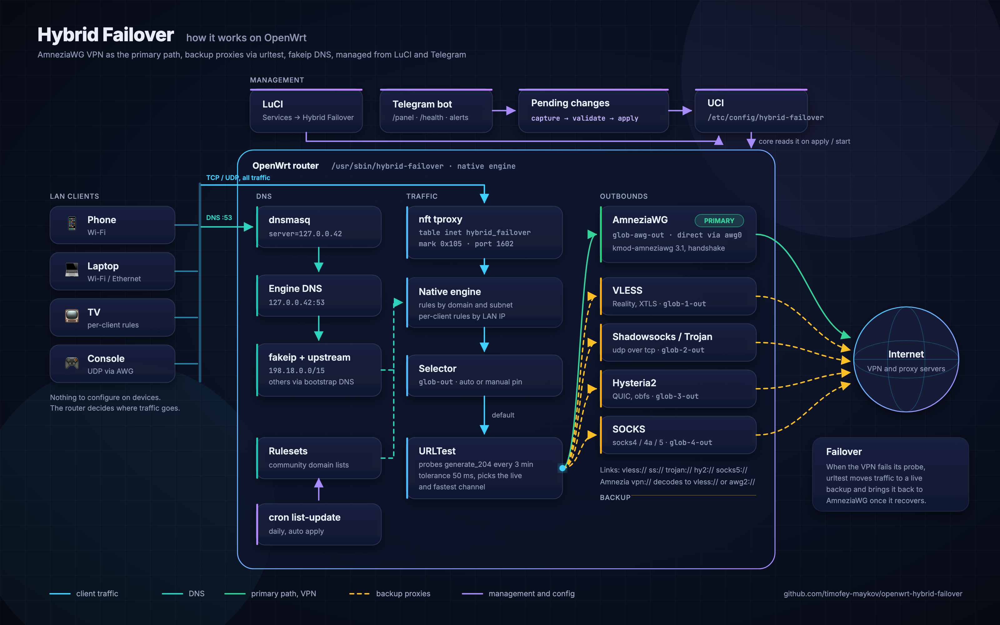
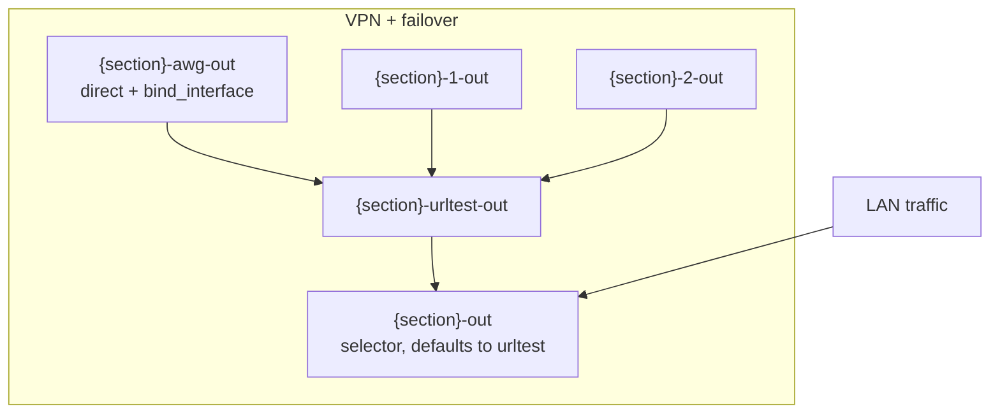
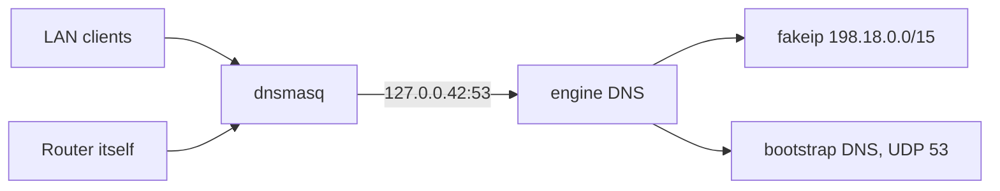

[Русский](../OVERVIEW.md)

# Hybrid Failover overview

A self-contained routing stack for OpenWrt. The `hybrid-failover` binary ships its own **proxy engine** (tproxy, DNS with fakeip, outbounds, urltest). It also supports Amnezia `vpn://` links, an extended URLTest, a Telegram bot and a LuCI app.

**Core:** `/usr/sbin/hybrid-failover` · **UCI:** `/etc/config/hybrid-failover` · **nft:** `inet hybrid_failover`

---

## Contents

1. [Architecture](#architecture)
2. [Routing modes](#routing-modes)
3. [Supported link formats (URI)](#supported-link-formats-uri)
4. [UCI options](#uci-options)
5. [OpenWrt packages](#openwrt-packages)
6. [Installation](#installation)
7. [LuCI](#luci)
8. [Per-client rules](#per-client-rules)
9. [Telegram bot](#telegram-bot)
10. [Diagnostics](#diagnostics)
11. [Troubleshooting](#troubleshooting)
12. [Repository layout](#repository-layout)

---

## Architecture



The Go core `hybrid-failover` reads UCI and compiles it into a plan for the built-in engine. It then sets up nft tproxy (table `inet hybrid_failover`, mark `0x105`, port 1602) and runs the engine inside its own process. procd supervises `hybrid-failover monitor`. That process hosts the engine, the failover policy controller and the watchdog.

There is no external sing-box anymore. The only mode is `settings.engine_mode=native`. The old `engine_mode=singbox` has been removed, and `hybrid-failover migrate` switches such configs to native. The `internal/singbox` package is still in the tree for tag naming and migration, but no traffic goes through it.

LuCI and the bot talk to the core through `hybrid-failover rpc <Method>`. LuCI reaches it via rpcd (the ucode script `/usr/share/rpcd/ucode/hybrid-failover`). A manual channel switch is handed to the running engine through IPC files in `/var/run/hybrid-failover`. The native engine has no Clash API HTTP server, so nothing listens on port 9090.



A section such as `glob` gets the following outbounds. The name is arbitrary and becomes the tag prefix.

| Outbound | Purpose |
|----------|---------|
| `{section}-awg-out` | Primary path, **direct** through the VPN interface (`option interface`, e.g. `awg0`) |
| `{section}-1-out`, `{section}-2-out`, ... | Backups from `failover_proxy_links`, one per URI |
| `{section}-urltest-out` | **urltest** over AWG and all backups |
| `{section}-out` | **selector**, points at urltest by default |

The order of URIs in the list sets candidate priority after the primary VPN. Within urltest the live and fastest one wins.

```text
hybrid-failover migrate [--dry-run]
hybrid-failover validate [--dry-run]
hybrid-failover apply [--dry-run]
hybrid-failover start|stop|reload|restart|status|health|monitor
hybrid-failover rpc <method> [json args]
hybrid-failover pending capture|validate|apply|rollback
hybrid-failover check-nft|check-proxy|check-fakeip|global-check
hybrid-failover list-update|subscription-refresh
hybrid-failover update check|apply|status [--tag vX.Y.Z] [--force]
```

### DNS via 127.0.0.42

On `start` the core points dnsmasq at the engine DNS unless `settings.dont_touch_dhcp=1` is set.

1. **dnsmasq.** The current settings are saved to `/etc/hybrid-failover/dnsmasq-dhcp.bak`, then `noresolv=1` and `server=127.0.0.42` are applied.
2. **Engine DNS.** Listens on `127.0.0.42:53`, hands out fakeip addresses from `198.18.0.0/15` and honours the community lists. Other names are resolved with a plain UDP query to `settings.bootstrap_dns_server` (77.88.8.8 by default). The native engine does not use `dns_type` and `dns_server` at the moment.
3. **Check.** `hybrid-failover check-fakeip` asks `127.0.0.42` for `fakeip.hybrid-failover` and expects a `198.18.x.x` address.

On `stop` dnsmasq is restored from the backup. At boot the init script first puts dnsmasq back on its normal upstreams if `127.0.0.42` was left there, so the LAN keeps DNS while the engine is still starting.



### Pending config (LuCI and bot)

LuCI and the bot do not commit UCI right away. They stage changes (`uci set` without `commit`), and the core keeps a snapshot of them in `/etc/hybrid-failover/pending`.

| Step | CLI | What it does |
|------|-----|--------------|
| Capture | `pending capture` | Reads `uci changes hybrid-failover` and merges them into the snapshot |
| Validate | `pending validate` | Checks keys and values in the snapshot |
| Apply | `pending apply` | Commits the staged changes, recompiles the plan and reloads the engine |
| Rollback | `pending rollback` | Deletes the snapshot |

The snapshot covers the case where staging is lost, for example when a reboot wipes `/tmp/.uci`. Then `pending apply` replays the changes from the snapshot. If the staged changes are still there, those are committed and the snapshot is not applied on top.

The same steps are exposed as the RPC methods `CapturePending`, `PendingValidate`, `PendingApply` and `PendingRollback`. On the LuCI routing page "Save" runs capture and "Apply" calls `pending_apply`.

### Lists and cron

- `list-update` downloads community lists into `/etc/hybrid-failover/rulesets/`. When they change, the core recompiles the plan and refreshes the engine without a full restart.
- `start` also runs a list update.
- `update_interval` in the `settings` section (default `1d`) controls a cron job running `hybrid-failover list-update`. The job is installed on `start` when the config has lists and removed on `stop`.

---

## Routing modes

### 1. VPN + failover

| UCI | Value |
|-----|-------|
| `connection_type` | `vpn` |
| `failover_vpn_enabled` | `1` |
| `failover_proxy_links` | list of URIs (see the table below) |
| `interface` | VPN interface, e.g. `awg0` |

Section traffic goes through the VPN interface first. When it fails, urltest moves to the backup proxies from the list.

### 2. Proxy with URLTest

| UCI | Value |
|-----|-------|
| `connection_type` | `proxy` |
| `proxy_config_type` | `urltest` |
| `urltest_proxy_links` | list of URIs |

Proxies only, no `bind_interface`. URI formats and urltest options are the same.

### 3. Own channels for lists

When a section has several channels, service lists can be spread over different tunnels so YouTube does not share a channel with everything else. Bindings are set on the "Сервисы и каналы" (Services and channels) tab or with `/route` in the bot and are stored in `config list_route`. A list with no binding goes through the section pool, as in the modes above. For each binding you choose what happens when its channel is down: fall back to the pool, go direct, or stay blocked. `balance` spreads the list's connections over all live channels while keeping each site on one channel. Your own named lists of domains and subnets (`config user_list`) are bound the same way as the ready-made ones. Details are in [UCI.md](UCI.md#config-list_route-name).

### Common URLTest options

| UCI option | Default | Description |
|------------|---------|-------------|
| `urltest_check_interval` | `3m` | Check interval |
| `urltest_tolerance` | `50` | Latency tolerance (ms) |
| `urltest_testing_url` | `https://www.gstatic.com/generate_204` | Probe URL |
| `urltest_idle_timeout` | empty | urltest idle timeout (e.g. `5m`) |
| `urltest_interrupt_exist_connections` | `0` | `1` drops existing sessions when the node changes |
| `enable_udp_over_tcp` | `0` | For SS and SOCKS entries in the link lists |

---

## Supported link formats (URI)

Links are parsed in Go (`internal/uri`). Amnezia `vpn://` is decoded by `internal/amnezia`, no Python needed.

### In `failover_proxy_links` and `urltest_proxy_links`

| Scheme | Supported | Notes |
|--------|-----------|-------|
| `vless://` | yes | Reality, XTLS Vision, TCP and UDP (XUDP). The native engine has no ws or grpc transport, such a link will not connect |
| `ss://` | yes | Shadowsocks |
| `trojan://` | yes | |
| `socks4://`, `socks4a://`, `socks5://` | yes | `enable_udp_over_tcp` if needed |
| `hysteria2://`, `hy2://` | yes | TLS (`sni`, `insecure`), obfs, `up`/`down` in mbps |
| `vpn://` | yes | **Amnezia** export, converted to `vless://` (xray) or `awg2://` (awg, awg2) |
| `awg2://` | yes (internal URI) | Not a protocol, see [below](#amnezia-awg2-awg2) |
| `amneziawg://` | subscriptions only | A whole AmneziaWG client config in base64, as subscription panels hand it out. Converted to `awg2://` when the subscription is loaded, the first peer is used |
| `http://`, `https://` | no | Fails with `unsupported scheme` |

### Amnezia `vpn://`

The decoder is built into the core (`internal/amnezia`). It handles the usual **amnezia-xray** export with VLESS in `last_config`. In LuCI you can paste a `vpn://...` string as is.

### Amnezia AWG2 (`awg2://`) {#amnezia-awg2-awg2}

`awg2://` is not a network protocol of its own. It is an internal core format for setting up **AmneziaWG**, including 3.1. The core does three things with it.

1. Creates an interface of type `amneziawg`.
2. Applies the config to it with `awg setconf`.
3. Adds a direct outbound bound to that interface to the engine plan.

An `awg2://...` string appears when a `vpn://` link is converted and the Amnezia container is `amnezia-awg2` or `amnezia-awg`. In LuCI you can paste the `vpn://` link directly.

The decoder carries the 3.1 fields into the `awg2://` query. These are `header_protection_key`, `content_padding_addition`, `random_trailers`, `disable_cookies`, the timers (`rekey_after_time`, `rekey_timeout`, `reject_after_time`, `keepalive_timeout`, `max_handshake_attempts`) and `persistent_keepalive` as a range (`25-35`).

#### Packages on the router

The core only writes the config. The tunnel itself is brought up by `kmod-amneziawg` and `amneziawg-tools`. Amnezia 3.1 exports (`protocol_version: 3.1`, `RandomTrailers`) need version 3.1 or later of both. They must be built for the same OpenWrt release and kernel vermagic as the router (`opkg info kernel`). Prebuilt `.ipk` files are often published in the [2Grey/awg-openwrt](https://github.com/2Grey/awg-openwrt) releases, tagged by OpenWrt version (for example `v24.10.6`).

```sh
awg --version          # should be 3.1.x, not 1.0.20260618
awg set --help | grep random-trailers
```

The 3.0 tools reject the config with `Line unrecognized: RandomTrailers=on`, and the interface stays down.

#### Handshake and parameter mismatch

`S1-S4`, `H1-H4`, `HeaderProtectionKey` and `RandomTrailers` must match the server. `RandomTrailers=on` works in both directions. A 3.1 server pads handshake packets, and a 3.0 client does not recognise them and silently drops them. From the outside this looks odd. conntrack shows the UDP flow as `ASSURED` with replies coming in, yet `awg show` reports `0 B received` and no handshake.

`DisableCookies`, `Jc`, `Jmin`, `Jmax` and `ContentPaddingAddition` do not have to match.

An old AWG 2.0 profile (ranges in `H1-H4`, `I1`, no `HeaderProtectionKey`) will not get a handshake from a 3.1 server port. Don't keep such URIs in `urltest_proxy_links` next to 3.1 ones, or the watchdog will keep cycling endpoints of a dead peer.

One `vpn://` link cannot be used on the router and in the Amnezia app on a LAN device at the same time. An AWG key gives one session. The phone takes over the endpoint and the router is left without a handshake.

```sh
awg show               # latest handshake, transfer
```

In urltest mode the channel card in LuCI looks at the HTTP check (`urltest_testing_url`) first. For AWG the handshake is taken into account on top of that. A fresh handshake with a failing HTTP check shows as "handshake есть, HTTP urltest не проходит" (the UI text is Russian). With no handshake, or one older than three minutes, the channel is shown as DOWN with a reason.

Traffic goes through the selector. While the selector points at urltest, the live channel is whatever wins the HTTP check, often Hysteria. An AWG handshake alone does not switch urltest. A manual "Switch" pins the selector to a specific outbound. The `SwitchProxy` command reaches the monitor process over IPC and does not wait for the next controller poll.

### Links added through the Telegram bot

The bot validates links with the same function as the core (`internal/validation`). It accepts `vless`, `trojan`, `ss`, `vpn`, `socks4`, `socks4a`, `socks5`, `hysteria2`, `hy2` and `awg2`.

---

## UCI options

The full table is in [`UCI.md`](UCI.md), example commands in [`examples/glob-uci-commands.txt`](../../examples/glob-uci-commands.txt).

The config lives in `/etc/config/hybrid-failover`. Run `hybrid-failover migrate` after installing or upgrading.

### Schema migration

On its first run `migrate` imports the previous UCI config if the new one does not exist yet. It then brings `settings.config_schema_version` up to 5.

| Schema | Changes |
|--------|---------|
| v1 | `failover_vpn_enabled=0` if the option was missing. `failover_vpn_enabled=1` for a VPN section that already has `failover_proxy_links`. `urltest_interrupt_exist_connections=0` if unset |
| v2 | Legacy client lists are moved into `client_rule` sections |
| v3, v4 | `settings.engine_mode=native`, including replacing `singbox` |
| v5 | `settings.disable_lan_ipv6=1` if the option is unset |

Migration v1 also writes `settings.cache_path`. That option is a sing-box leftover and the native engine ignores it.

---

## OpenWrt packages

Packages are built by `./scripts/build-packages.sh` and published under [Releases](https://github.com/timofey-maykov/openwrt-hybrid-failover/releases).

Binaries are compressed with **UPX** when `upx` is present on the build host. On `aarch64` that takes a binary from about 6 MB down to about 1.8 MB. Set `HF_UPX=0 ./scripts/build-packages.sh` to turn it off. Install upx with `brew install upx` or `apt install upx-ucl`.

| Package | Architecture | Contents |
|---------|--------------|----------|
| `hybrid-failover-core` | per-target | `/usr/sbin/hybrid-failover`, init.d, UCI template |
| `hybrid-failover-bot` | per-target | Bot binary, init.d, JSON and UCI templates |
| `luci-app-hybrid-failover` | all | Routing, dashboard, clients, bot, updates |
| `luci-i18n-hybrid-failover` | all | LuCI translations |

The core package depends on `ca-bundle`, `uci` and `procd`. The installer also pulls in `curl` and `wget`. `check-fakeip` does not need `bind-dig`. Nothing requires `jq`, `python3-light` or an external sing-box. `kmod-amneziawg` and `amneziawg-tools` are not part of the HF release. If you use `vpn://` with AWG 3.1, install them yourself, see [INSTALL.md](INSTALL.md#amneziawg-31).

---

## Installation

Full instructions are in [`INSTALL.md`](INSTALL.md).

```sh
wget -O /tmp/install.sh \
  https://raw.githubusercontent.com/timofey-maykov/openwrt-hybrid-failover/main/scripts/install-on-router.sh
ash /tmp/install.sh
hybrid-failover migrate
/etc/init.d/hybrid-failover enable && /etc/init.d/hybrid-failover start
```

| Mode (`HF_MODE`) | Installs |
|------------------|----------|
| `full` (default) | core, bot, luci-app-hybrid-failover |
| `core` | core and LuCI, no bot |
| `bot` | the bot only |

### After installing the bot

1. Get a token from [@BotFather](https://t.me/BotFather) and put it into `/etc/hybrid-failover-bot.json`.
2. `uci set hybrid-failover-bot.main.enabled=1 && uci commit hybrid-failover-bot`
3. `/etc/init.d/hybrid-failover-bot restart`
4. Send `/panel` to the bot in Telegram.

---

## LuCI

**Services -> Hybrid Failover**, at `/cgi-bin/luci/admin/services/hybrid-failover`. The interface is in Russian.

The detailed guide to tabs, clients, the DHCP picker and pending changes is in [LUCI.md](LUCI.md).

| Page | Purpose |
|------|---------|
| Обзор (Overview) | Dashboard: engine, nft, channels and latency, policy controller, switch log, manual switch |
| Маршрутизация (Routing) | VPN + failover, URLTest, subscriptions, community lists (through pending) |
| Сервисы и каналы (Services and channels) | Section channels with their load, binding lists to channels, your own lists, automatic spread |
| Графики (Charts) | Live per-channel charts: traffic, connections, latency, traffic share, from 5 minutes up to a day |
| Диагностика (Diagnostics) | validate, global-check, UCI backup |
| Клиенты (Clients) | `client_rule` by IP, effective rules, IP picker from DHCP |
| Telegram | Bot JSON, pending validate, apply and rollback |
| Обновление (Update) | Check for and install new releases (`hybrid-failover update`) |

Every action goes through rpcd to `hybrid-failover rpc`.

---

## Per-client rules

Global routing (sections, domain lists) decides which traffic goes to the engine. Client rules decide which LAN devices take part and how.

In UCI these are `config client_rule` sections. In LuCI they live under **Клиенты -> Правила клиентов**.

| `mode` | Behaviour |
|--------|-----------|
| `include` | The client gets the nft mark and goes through tproxy into the engine |
| `exclude` | The client bypasses Hybrid Failover (direct) |
| `full_route` | All of the client's traffic goes through the given section (`option section`) |
| `global_exclude` | The client is excluded from tproxy globally |

The effective rules on the Clients page come from `hybrid-failover rpc ListClients` (read-only). An empty list with the core running means there are no rules. It is not an error.

Legacy lists (`settings.include_source_ips`, `exclude_source_ips`, per-section `fully_routed_ips`) are moved into `client_rule` by `migrate`. As long as at least one `client_rule` exists, the legacy lists are ignored.

```sh
# Example: route a console at 192.168.1.50 through HF
uci set hybrid-failover.console=client_rule
uci set hybrid-failover.console.ip='192.168.1.50'
uci set hybrid-failover.console.mode='include'
uci commit hybrid-failover
hybrid-failover reload
```

See also [UCI.md](UCI.md) and [LUCI.md](LUCI.md).

---

## Telegram bot

The full list of commands and settings is in [`bot/README.en.md`](../../bot/README.en.md).

- The bot edits the `hybrid-failover` UCI config through the pending workflow (validate, apply, rollback).
- Status, channel checks (`/health`, `/channels`) and history (`/history`) come from core RPC (`Status`, `Health`, `History`). No Clash API is involved.
- `admin_ids` get full access. `viewer_ids` are read-only (`/status`, `/health`, `/channels`, `/history` and panel navigation).
- Failover links are accepted in the same schemes as the core accepts.

The config file is `/etc/hybrid-failover-bot.json`.

| Key | Purpose |
|-----|---------|
| `token` | Bot token from @BotFather |
| `router_name` | Router name in the panel, status and notifications (defaults to the hostname) |
| `admin_ids`, `viewer_ids` | Telegram IDs of admins and viewers |
| `log_path`, `audit_path` | Bot log and action audit log |
| `routing_init_script` | Defaults to `/etc/init.d/hybrid-failover` |
| `uci_package`, `main_section` | UCI package and main section (usually `glob`) |
| `policy`, `probe_timeout_seconds` | Policy and probe timeout |
| `notify_failover_enabled`, `notify_failover_interval_seconds` | Switch notifications and their poll interval |
| `routers` | Managing several routers over SSH |
| `clash_api` | Only relevant for old sing-box installs |

### Several routers

Telegram delivers updates for a token to a single consumer. The recommended setup is one bot per router, each with its own token and its own `router_name`. If you want a single chat for all routers, one bot can manage the others over SSH through the `routers` list, with the bot disabled on the other routers. Details and an example config are in [`bot/README.en.md`](../../bot/README.en.md).

### Failover alerts

**From the bot.** Set `notify_failover_enabled: true` in `hybrid-failover-bot.json`. The bot reads `/var/log/hybrid-failover/history.jsonl` every `notify_failover_interval_seconds` (30 s by default) and sends new events to every `admin_ids` entry. It stores the time of the last delivered event in `/var/run/hybrid-failover-bot/history.state`, so log rotation does not cause repeats. In the SSH setup, notifications come only from the router the bot runs on.

**From a core webhook.** Put an HTTP endpoint into `hybrid-failover.settings.webhook_url`. On every automatic switch the core sends a `POST` with the event as a JSON body.

```json
{"time":"2026-09-29T10:15:00Z","section":"glob","from":"glob-awg-out","to":"glob-1-out","reason":"primary outage","policy":"outage-only"}
```

Any relay of your own can receive it and, for example, forward the text to Telegram with `sendMessage`. The core only makes the `POST` and expects a 2xx reply.

---

## Diagnostics

The engine has no HTTP API of its own. State is available through the CLI, RPC and the system log.

```sh
hybrid-failover status          # JSON: engine, nft, fakeip, active outbound, controller
hybrid-failover health          # same plus live channel probes
hybrid-failover global-check    # same as status
hybrid-failover check-fakeip    # DNS query to 127.0.0.42, no dig needed
hybrid-failover check-nft       # inet hybrid_failover table is in place
hybrid-failover rpc Health      # what LuCI and the bot see
logread -e hybrid-failover
```

The `clash_ok` field in the report is kept for compatibility. In native mode it simply mirrors `engine_running`. The `settings.clash_api_listen` option has no effect on the native engine.

In the bot, `/status`, `/health` and `/channels` show the same data.

---

## Troubleshooting

### No effective rules, empty table on the Clients page

The core may be running fine (`engine_running: true` in the status). The message means there are no `client_rule` sections. Add a rule on the Clients page or through UCI, see [LUCI.md](LUCI.md).

### No leases, empty DHCP picker

The picker reads the dnsmasq lease file (`/tmp/dhcp.leases`).

```sh
cat /tmp/dhcp.leases
/etc/init.d/dnsmasq status
```

On OpenWrt `ubus call dhcp ipv4leases` only returns data when odhcpd is the main DHCPv4 server. dnsmasq leases never show up there.

### check-fakeip fails or the LAN has no DNS

Make sure the engine is running and dnsmasq points at it.

```sh
hybrid-failover status
uci -q get dhcp.@dnsmasq[0].server   # should be 127.0.0.42
hybrid-failover check-fakeip
logread -e hybrid-failover | tail -50
```

If a stale dnsmasq instance holds `127.0.0.42:53`, run `/etc/init.d/hybrid-failover restart`. The core checks for this case on start.

### Double failover

If you are moving to Hybrid Failover, remove third-party automatic failover scripts and disable conflicting routing init.d services. `hybrid-failover migrate` warns about the conflicts it finds.

---

## Repository layout

| Path | Purpose |
|------|---------|
| `core/`, `internal/` | Go core and the built-in engine |
| `packages/`, `packaging/` | `.ipk` and `.apk` builds, release workflow |
| `luci/` | luci-app-hybrid-failover |
| `bot/` | Telegram bot |
| `openwrt/` | init.d, UCI template |
| `curfew/`, `luci-curfew/` | Separate curfew package (rate-limits LAN devices) and its LuCI app |
| `examples/` | Sample UCI commands and a multi-router bot config |
| `scripts/` | install-on-router.sh, build-packages.sh, QEMU lab |
| `docs/` | Documentation |
| `legacy/` | Archived migration notes |

The project README is [README.en.md](../../README.en.md). Package sizes and overlay space are covered in [SING-BOX-SIZE.md](SING-BOX-SIZE.md).
